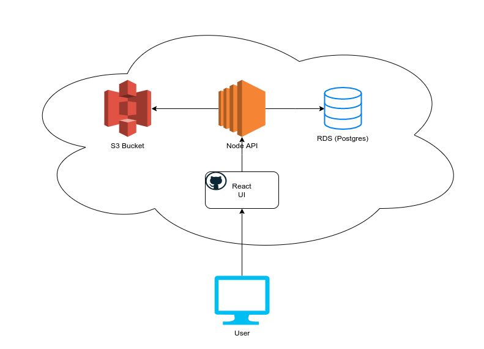

# Live Control

## Architecture



The live site for this project is accessible [here](https://jahorwitz.github.io/). The front-end is a react application that is hosted on github pages. The front-end interacts with a node (express) server that is deployed to AWS EC2 (for configuration purposes as opposed to ECS / Lambda). 

The express server exposes three endpoints to retrieve, update, and post new content. The GET endpoint is publicly accessible, whereas the PUT and POST endpoints are password protected (a hack to avoid implementing a real auth system for now). The password is stored as an environment variable on the server.

When the API receives a new upload request, it runs a conversion on the video so that lower quality versions can be provided. After that, it uploads the different versions of the video to an S3 bucket and enters the records (with references to the filename in S3) into the database.

The API is currently deployed on a free-tier EC2 instance, and the video conversion is a fairly heavy processing load, so currently it is only able to handle shorter videos in a reasonable amount of time. When running locally on a machine with more resources, I was able to verify that it can process larger videos (tested with videos up to 600 mb), although it takes a while to run the conversion. I did run a larger video through while it was deployed to the free-tier server and it eventually processed the whole thing (it took about an hour to finish).

## Running locally

### Running the UI

* In the .env file, replace the S3 bucket you want to use and the base API url
* install dependencies ```npm install```
* start the app ```npm run start```

### Running the API

Running the API locally will likely be challenging in its current state due to the reliance on a database, S3 bucket, and the ffmpeg tool, but these are the requirements if one wanted to do so:

* Create the S3 bucket - this could also be altered in the code so that if no bucket is provided then it defaults to the local filesystem. I created the S3 bucket from the beginning intending to go this route, so the code would have to be altered to allow that.

* Create the postgres database - this could be local or in the cloud, all that is required is to provide the connection information in the .env file.

* Example .env file:
```
S3_BUCKET=<BUCKET NAME>
AWS_ACCESS_KEY_ID=<ACCESS KEY ID>
AWS_SECRET_ACCESS_KEY=<SECRET ACCESS KEY>
ADMIN_UPLOAD_PASSWORD=<PASSWORD FOR PUT / POST ENDPOINTS>

RDS_USERNAME=<DATABASE USERNAME>
RDS_PASSWORD=<DATABASE PASSWORD>
RDS_HOSTNAME=<DATABASE HOST NAME>
```

* Run ```npm install``` in the api project

* Ensure that ffmpeg and ffprobe are both installed on your machine. Depending on what type of machine you have, this can be an extremely arduous process. If you're on linux like me, download the source for ffmpeg and follow the instructions in the tar ball to configure and build it. You will need to ensure you have all of its dependencies installed as well, particularly libx264 (the video codec the conversion relies on). Installing these dependencies can be tricky, but don't worry because the docs aren't very helpful.

## Quirks / Hacks / Challenges left to solve

* It would be nice to have thumbnails for each video to display in the side-rail. I could implement this with another conversion process on the API, but didn't have time to do so.

* The way the upload / update endpoints are protected is obviously not secure and should be fixed with proper auth headers. The API also currently returns the password in the response from the server.

* The conversion process is really computationally heavy / expensive. This should likely be done with a serverless function, but the setup for ffmpeg is fairly tricky and so some work would have to be put into that.

* Because github pages uses SSL and the API doesn't, I had to pass the request through https://cors-anywhere.herokuapp.com to get the request through.

## Improvements needed to be production-ready code

* Error handling on the UI is extremely minimal at this time- it should be improved on in the future. There are minimal checks for errors and there is no validation done on file uploads. Likewise, minimal testing was done on different video formats (so far, only MP4s were tested) and it's unclear if the conversion process as it is now would work for other formats.

* There needs to be some kind of ORM or something in place for the PUT endpoint at the very least, currently it is likely vulnerable to SQL injection when a user updates the title because of the way we are performing raw queries.

* There is no automated testing for anything- automated testing might be particularly difficult on the conversion process since it uses ffmpeg.

* Most of the logic in the API is contained in one file- when writing code for production I prefer to keep it more organized into controllers and services, however this was a little thrown-together.

* Similarly, I would prefer to go through the UI code and extract more components that can be re-used across the app.

* CSS in the UI is mostly done inline currently, I would prefer to extract it to styled components or something more scalable in a long term project.
